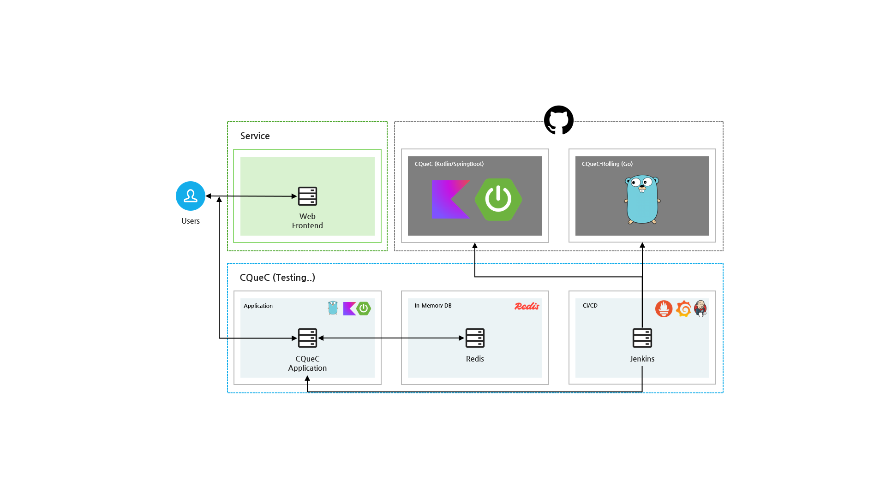

# Queueing Service

> 대규모 사용자 대기열 처리를 위한 고성능 Queueing 서비스

---

## 📚 Tech Stack

### 🚀 Back-End
- **Language**: Kotlin 2.0.0
- **Framework**: Spring Boot 3.4.4
- **Runtime**: JDK 21

**이미지 예시:**
> 

---

### 🛢️ In-Memory DB
- **Redis**
    - **Cluster / Sharding 구성**
    - **자료구조 활용**:
        - **SET**: Processed 사용자 관리
        - **ZSET(Sorted Set)**: Waiting Queue 관리

**이미지 예시:**
> 

---

### 🛡️ Queue Management

- **Processed (SET)** : 이미 입장 완료한 사용자 기록
- **Queueing (Sorted SET - ZSET)** : 대기열 관리 (순번, ETA 계산)

**이미지 예시:**
> 

---

### ⚙️ CI/CD

- **Jenkins** : Build / Deploy 자동화
- **GitHub Webhooks** : `main` Branch 감지 후 자동 배포

**이미지 예시:**
> 

---

### 🧩 Infrastructure

- **Kubernetes (예정)** : 대기열 서비스 Pod 배포 및 관리 (이미지 배포 예정)
- **Auto Scaling** : 트래픽 폭주 대응
- **Prometheus + Grafana** : 자원 모니터링링

> 

---

### 📈 Benchmark

- **nGrinder** : 부하 테스트 진행
    - 10만 사용자 동시 접속 시 대기열 처리 성능 검증

**이미지 예시:**
> 

---

## 👥 Contributors

| 이름 | 역할 |
|-----|------|
| (네가 작성할 이름1) | 백엔드 개발 |
| (네가 작성할 이름2) | 인프라 및 모니터링 구축 |

---

## 📄 프로젝트 설명

본 프로젝트는 대규모 트래픽 상황에서도
- 사용자 순번 대기
- 처리 완료
- ETA 예측
- 자동 확장(AutoScaling)

이 모두를 지원하는 **고성능 Queue 시스템** 구축을 목표로 하였습니다.

✅ **10만 명 이상 동시 접속 처리 가능**  
✅ **Redis Cluster를 통한 확장성 보장**  
✅ **MSA 구조 + Monitoring 통합**

---

## 📈 Performance Test (nGrinder)

본 프로젝트의 대기열 서비스 성능을 검증하기 위해 nGrinder를 사용하여 부하 테스트를 진행하였습니다.

### 📋 테스트 요약

| 항목 | 결과 |
|-----|-----|
| 총 가상 사용자 (Vuser) | 6,000명 |
| 테스트 에이전트 수 | 3개 |
| 프로세스 / 쓰레드 수 | 10 / 200 |
| 테스트 총 실행 수 | 7,411,514건 |
| 성공한 요청 수 | 7,411,473건 |
| 에러 수 | 41건 |
| TPS (Transactions Per Second) | 평균 12,775 TPS |
| 최고 TPS | 14,558 TPS |
| 평균 응답 시간 | 416.93 ms |
| 테스트 기간 | 10분 |

✅ **성공률 약 99.999%**  
✅ **최대 14,558 TPS 처리 성능**  
✅ **평균 응답 시간 416ms 수준으로 처리**

---

### 🛠 테스트 도구

- **nGrinder v3.5.9-p1** 사용
- 에이전트 3개 분산
- 부하 분산 테스트 스크립트 작성 및 적용

### 📈 테스트 진행 흐름

1. 초기 대기열 세팅
2. 다수 사용자(가상 유저) 동시 접속 부하 생성
3. 요청 성공률 및 평균 응답 시간 기록
4. TPS(초당 처리량) 추적 및 최고 처리량 측정

---

### 📊 결과 요약 그래프 (추후 삽입)

> *(성능 그래프나 응답 시간 분포 차트 추가 가능)*

---

